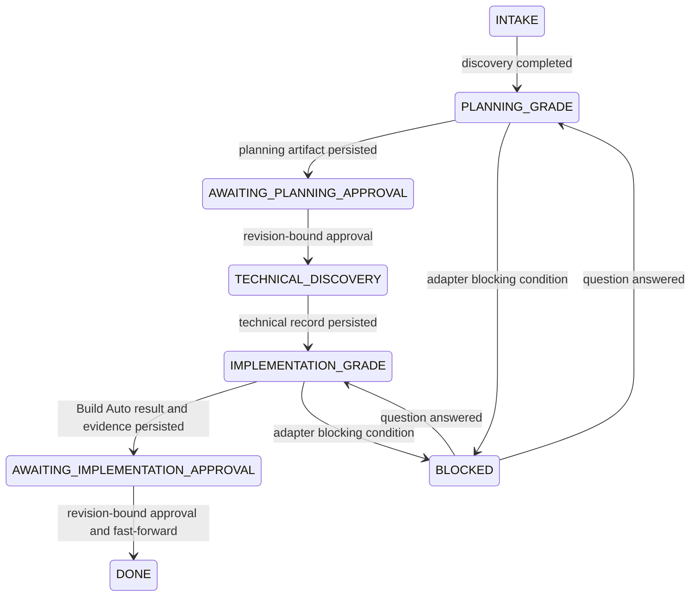

# MIC Development Lifecycle

The combined execution and lifecycle milestone implements one path through the control plane:

`WorktreeManager` creates `mic/<work-item>/<run>` branches at immutable baselines. `OpenCodeAdapter` starts a bounded child process, captures stdout/stderr and persists terminal telemetry under the ignored `.mic/runs/` directory so it can be recovered after MIC restarts. `BmadDirectAdapter` invokes the project-installed `bmad-spec` or `bmad-build-auto` skill through OpenCode and trusts durable BMAD status/artifacts rather than a successful process exit alone.

Planning and implementation artifact rows store both baseline and result Git revisions plus a content hash. Approval rows bind the approver to that hash and result revision. The implementation approval fast-forwards the repository to the approved result and removes the worktree. A non-fast-forward is rejected so concurrent base changes cannot be silently overwritten.

When BMAD reports `blocked`, MIC stores the condition as a question linked to the run and records the stage in `resume_ref`. Answering the question changes it to `ANSWERED` and returns the work item to that stage. MIC does not retry a blocked run blindly.

The checked-in tests use a deterministic executor for lifecycle behavior and a real Git repository for worktree isolation. The real execution service is wired into `src/main.ts`; observed Build Auto artifacts and blocked payloads will replace or extend the Phase-0 fixtures when those paths first occur.
