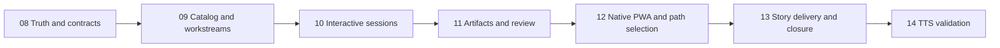

# Epic – BMAD-native MIC PWA

**Status:** planned
**Active sprints:** 08–14
**Product direction:** [BMAD-native platform plan](../docs/bmad-native-platform-plan.md)

## Outcome

Deliver a local browser application that helps Michael use the installed BMAD system faithfully and effectively. MIC will guide path selection, host durable BMAD workflow conversations, render and relate BMAD artifacts, direct human attention, dispatch individual implementation units, preserve Git isolation and provenance, and expose review evidence through one coherent PWA.

MIC must treat BMAD as the development method. It must not replace BMAD's workflow semantics with a second fixed lifecycle.

## User value

From one project workspace, Michael can:

1. describe work and receive a grounded BMAD path recommendation;
2. understand which BMAD workflow is running and why;
3. participate in its questions, menus and decision points;
4. read, compare, review and revise the artifacts it creates;
5. follow a direct-change, spec-backed-epic or project-sized path;
6. see story progress and dispatch exactly one valid implementation unit;
7. inspect review, tests, evidence and a guided walkthrough;
8. accept, rework or stop work without losing history;
9. recover safely after a service or model interruption.

## Architectural rules

- The installed BMAD catalog, skill manifests and artifacts are authoritative.
- MIC discovers capabilities and does not hard-code a universal BMAD sequence.
- BMAD owns workflow steps and artifact semantics.
- MIC owns durable sessions, Git workspaces, resource policy, queues, provenance and attention routing.
- A fresh session is created for each BMAD workflow; artifacts carry context between workflows.
- Build and Build Auto receive one session-sized intent or story.
- Build Auto never chooses the next story or owns a backlog.
- Human decisions bind to exact artifact revisions or commits.
- Invalid or incomplete artifacts do not advance work merely because a process exited successfully.
- GPT-OSS 120B remains the default model for normal MIC execution.

## Scope

### Included

- installed-module and skill discovery;
- workstreams and adaptive BMAD paths;
- durable interactive workflow sessions;
- structured artifact indexing and validation;
- in-app document, YAML, revision and relationship views;
- `bmad-help` recommendations;
- direct Build, spec-backed epic and project-sized planning paths;
- story and sprint tracking;
- attended Build and single-unit Build Auto dispatch;
- blocked questions, cancellation and recovery;
- code review, walkthrough, retrospective and correct-course workflows;
- optional ordered `bmad-loop` dispatch after its contract is validated;
- end-to-end validation through the existing TTS repository.

### Excluded

- rewriting or forking installed BMAD skills;
- inventing a second planning methodology;
- cloud hosting, multi-tenant authentication or organization administration;
- generic issue-tracker replacement;
- automatic parallel project coordination beyond contracts BMAD or bmad-loop actually provide;
- implementing the TTS feature before the platform reaches Sprint 14.

## Sprint sequence

Each sprint must leave a demonstrable product increment. Later sprints may correct assumptions exposed by earlier empirical contract work, but they may not bypass the preceding acceptance boundary.

## Epic acceptance criteria

- The browser can drive all interactions needed for a real BMAD spec-backed epic without terminal intervention.
- The same platform can begin a direct Build or project-sized planning path without code changes.
- `bmad-help` recommendations cite the artifacts and installed capabilities used to reach them.
- Workflow sessions survive process restart and distinguish waiting for input from completion or failure.
- Artifact history preserves BMAD memlogs and rejects invalid revisions.
- Stories are dispatched one at a time with correct parent context and Git provenance.
- Reviews and feedback route back to the workflow or implementation unit that owns the decision.
- The TTS feature is planned, built, reviewed and accepted through MIC in Sprint 14.
- The TTS base branch is never modified before final user approval.

## Epic review

Sprint 14 produces the epic acceptance report. The report must separate platform findings from TTS feature findings and record any deferred work without representing it as complete.
